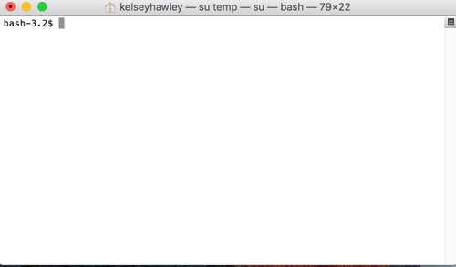
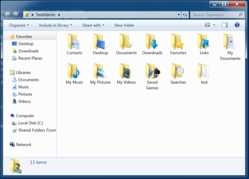
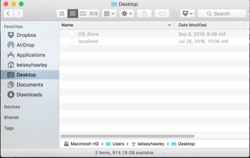

# What is the Command Line?

The command line is a text based interface for interacting with the files on your computer.  Just like the Windows File Explorer or Mac Finder are _gui_'s (Graphical User Interface) for interacting with your computer files.

You can create, delete and edit all files and folders (and more) from the command line, just like you can with the gui explorers.

Text Based Terminal  

GUI  
 

You may here the terms hear other terms being used to reference the command line, such as _terminal_, _bash_ or _shell_.  This tutorial will use _command line_ and _terminal_ interchangeably.
