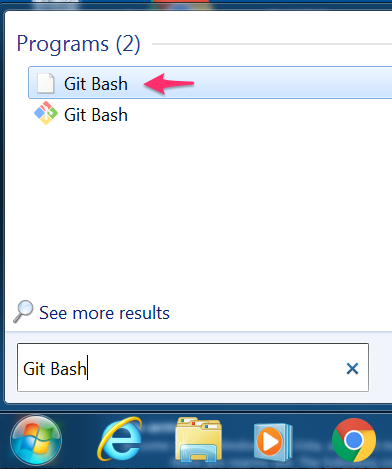

# Open a Terminal Window

On Mac, go to the Spotlight magnifying glass, and type _Terminal_.

On Windows:

- Download [Git](https://git-scm.com/download/win).  This comes bundled with the terminal **Git Bash**, and _Git_ will be required in the next Git Book tutorial focused on learning _Git_.
- Open the Start Menu, and type _Git Bash_ in the search box.

