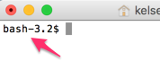
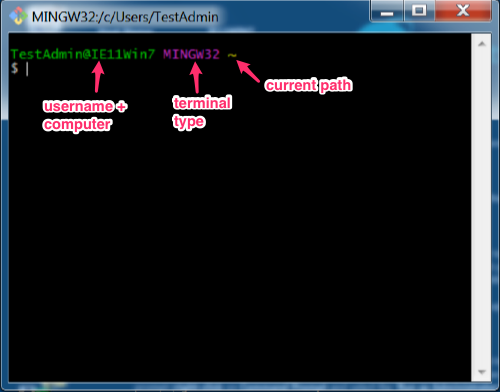

# The Prompt

The prompt is the text that appears before your cursor in the terminal.  It may contain a file path (Windows example in yellow), your username on your computer (Windows example in green), or simply the type of terminal language, like bash (Mac terminal example).





When reading tutorials, like this one, we designate the prompt with a `$` before any command.  Like this:

```
$
```

Any command to be executed in the terminal will appear like that from now on.

Some tutorials may use something different to denote a command to be run in the terminal, but this is the most universally accepted way.
