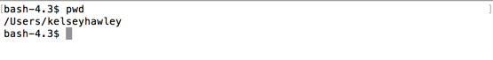

# pwd

`pwd` will print your working directory.  This is the location your command line currently has open.

On Mac:

```
$ pwd
```



This shows the path to the folder you are currently in.  Knowing the folder you are in and the path to it is how we can use more complex commands going forward.