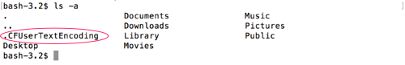

# ls -a, ls -l

## -a

If we add the flag `-a` to the command, we can see _hidden files_.

Hidden files start with a `.` before their name.

```
$ ls -a
```

You can see in my example, there is a hidden file called `.CFUserTextEncoding`.  Most hidden files are added by the system.  If you don't know what its for _leave it alone_.




## -l

If we add the flag `-l` to the command, we can see a list view of the files, with lots of extra data.

```
$ ls -l
```

The file and folder names are now in the last column.  The columns before it have a date string of when it was last modified, its size in bytes, and information about ownership and permissions.


## -la, -al

We can also combine the flags into one, like `-al` or `-la`.  The order doesn't matter, as the result will be the same.  We will see a long list of our files, including any hidden files.

```
$ ls -la
```

