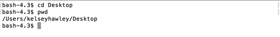

# cd

When we want to change to a different directory, we use the command `cd`.

If I wanted to go into my Desktop (which I saw was a subfolder), I could use `cd` like this

```
$ cd Desktop
```



I checked with `pwd` to confirm I was in a subdirectory of my previous folder.  `Desktop` is now my current directory.
