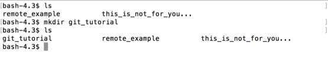

# mkdir

We're currently in the `Desktop` folder.  Lets make a new directory.

`mkdir` will make a new directory in our current location.  `mkdir` also needs to know the name of the folder to create.  `mkdir <new_folder_name>`

Lets make a folder called `git_tutorial`.  This will be perfect if you're continuing into the next git book to learn Git.

(Make sure you don't have a folder already on your Desktop with that name)

```
$ mkdir git_tutotial
```

 
 
 If we look inside `git_tutorial`, we'll see that its empty.
 
```
$ ls git_tutorial
```


Now, lets create a nested directory, and `cd` into it.

```
$ mkdir git_tutorial/nested
$ cd git_tutorial/nested
```


