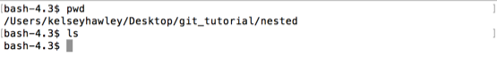
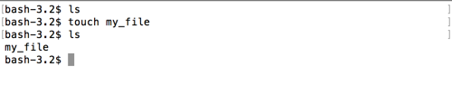

# touch

Inside our nested directory, lets create some files.  The easiest way to make a file, is using `touch`.  This command will create an empty file if it doesn't exist, or ignore the file if it does.  `touch`, like `mkdir`, requires an argument.  `touch <file_name>`

First, lets confirm this is an empty directory.

```
$ ls
```


Yep, empty directory.  Now lets create a new file `my_file`

```
$ touch my_file
```

Now if we `ls` the directory, we can see we have a new file in the list.


