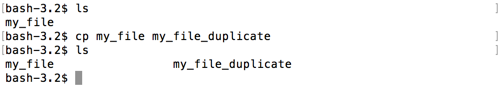

# cp

Lets make another file in this directory.  Instead of using `touch`, we're gonna use `cp` to _copy_ `my_file` and create a duplicate.

`cp` takes two arguments, like so:  `cp <file_to_be_coped> <file_to_be_created>`

Let's create a copy of our `my_file` called `my_file_duplicate`

```
$ cp my_file my_file_duplicate
```

And if we `ls`, we'll see both files in our directory.

