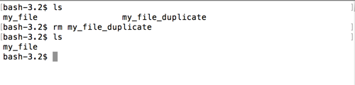

# rm

Let's say we don't actually want 2 copies of the same file.  So, let's remove one.

`rm` takes an argument of the file you want to remove.  `rm <filed_to_delete>`

Let's remove the duplicate file.

```
$ rm my_file_duplicate
```


