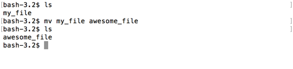
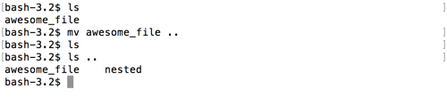
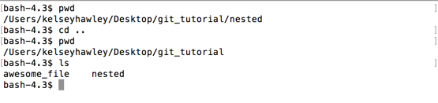

# mv

Turns out `my_file` is a little big vague.  Let's rename it.  

`mv` takes two arguments.  `mv <current_file_name> <new_file_name>`

```
$ mv my_file awesome_file
```



But what if we want to move its _location_ not just change its name?

`mv` also takes _file paths_ and not just file names.

`mv <current_file> <new_location>`

Let's move our `awesome_file` up a directory, into `git_tutorial`.  Remember that `..` is a shortcut for the parent directory.

```
$ mv awesome_file ..
```

And if we `ls`, you'll see the file has disappeared.  If we `ls ..`, you can see that the parent has both our `awesome_file` and the directory `nested`.



We could have also _combined_ the move and rename into one command, like this `mv <current_file> <new_path>/<new_name>`

Let's `cd` into that parent directory now.

```
$ cd ..
```


