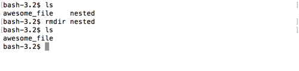
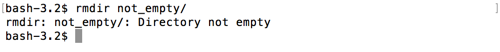
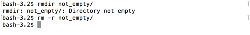

# rmdir

Since we're finished with our `nested` directory, lets remove it.

`rmdir` is the command to remove an empty directory. `rmdir` takes an argument of the directory to be deleted.  `rmdir <directory>`

```
$ rmdir nested
```



Its important to note, that `rmdir` expects an _empty_ directory.  If it isn't empty, you'll get a complaint like this:



## Using rm with directories

`rm` can also be used with directories.  To remove a non-empty directory you _must_ use `rm`.

To remove a directory that has contents that you want to delete too, you can pass a `-r` command to the folder and its contents permanently.  The `-r` flag stands for _recursive_.  So the command will go through each directory in the contents and delete its children.  The command would look like `rm -r <directory>`

Be careful when using `rm`, especially with the `-r` as there is no 'trash' to recover your accidental deletes from.

An example with that flag:


